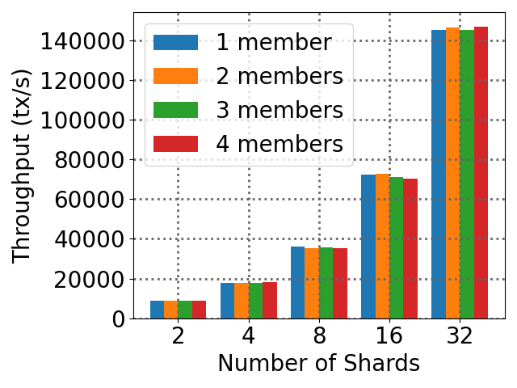
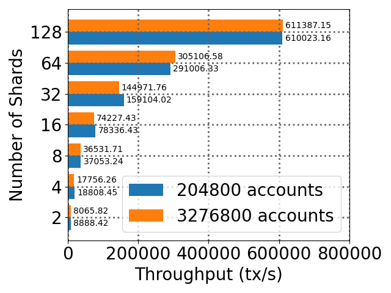

# MeepoBenchmark


## Introduction

This project aims at providing the scripts, logs, and analytic results for Meepo Blockchain (the Rust implementaion on OpenEthereum).

In short, it provides open-source and reproducible benchmark results for [Meepo-OpenEthereum](https://github.com/InPlusLab/Meepo).

## Test-bed

We use 128 AliCloud servers as a test bed. Each machine is equipped with 4 vCPU, 32 GiB memory, and 894 GiB NVME disk. The detailed configuration of the ECS (ecs.i2.xlarge) can be found [here](https://help.aliyun.com/document_detail/25378.html?spm=5176.2020520101.help.dexternal.73954df5vwQcgq#i2).

## Availibility

All the logs are in the `meepo128/` directory in this repo.
With the following commands, you can verify the results afterwards.

```bash
$ git clone http://github.com/tczpl/MeepoBenchmark/
$ cd MeepoBenchmark/meepo128
$ ls *.zip | xargs -n1 unzip # you should install unzip first or mannualy unzip
$ cd .. 
$ python3 rq1-1_tps.py # or other Python script
```

## Key Results

### ERC20 Cross-shard Performance
|  Cross-shard TPS in differnt scales (102400 accounts per shard, 32x4=128 machines in maximum)    |  Corresponding Latency in differnt scales  |
|  ----  | ----  |
|   |  |


|  Cross-shard TPS in differnt shards and total accounts (1 member) | Cross-shard TPS in differnt total accounts (32 shards, 4 consortium members, 128 machines)    |
|  ----  | ----  |
|   |  |


### Taobao E-commerce Performance

| TPS in differnt scales (4 consoritum members, 32x4=128 machines in maximum)    |  Processing time of block duration   |
|  ----  | ----  |
|   |  |

|  Cross-shard communication time per block | Number of cross-epochs  per block |
|  ----  | ----  |
|   |  |


